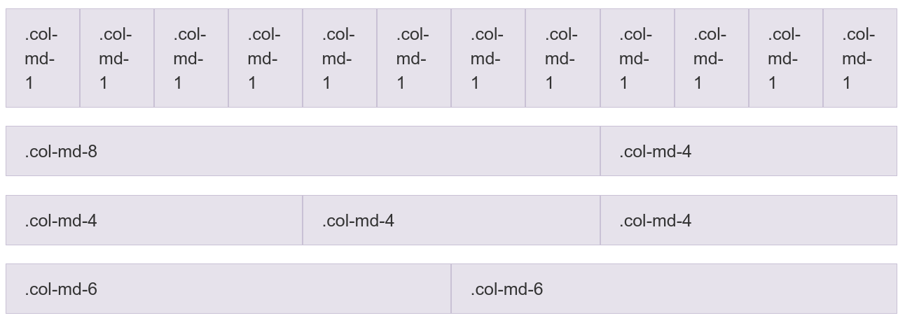

# CSS3: layout e responsividade

[Slides desta aula (PDF)](slides/aula_05_css_layout.pdf)

## Bibliografia recomendada para o tema

* [MDN - CSS](https://developer.mozilla.org/pt-BR/docs/Web/CSS);
* [MDN - Conceitos básicos do Flexbox](https://developer.mozilla.org/pt-BR/docs/Web/CSS/Guides/Flexible_box_layout/Basic_concepts);
* [MDN - CSS Grid Layout](https://developer.mozilla.org/pt-BR/docs/Web/CSS/Guides/Grid_layout);
* [MDN - Usando media queries](https://developer.mozilla.org/pt-BR/docs/Web/CSS/Guides/Media_queries/Using);
* [CSS-Tricks - A Complete Guide to Flexbox](https://css-tricks.com/snippets/css/a-guide-to-flexbox/);
* [CSS-Tricks - A Complete Guide to Grid](https://css-tricks.com/complete-guide-css-grid-layout/);
* [Documentação do Bootstrap 5.3](https://getbootstrap.com/docs/5.3/getting-started/introduction/);
* SILVA, Maurício Samy. **CSS3**. São Paulo: Novatec, 2012 (bibliografia básica da disciplina).

> Este material continua os [fundamentos de CSS](./aula_05_00_css.md): seletores,
> cascata, especificidade, modelo de caixa, unidades, cores e tipografia. A caixa
> que o Flexbox e o Grid posicionam é a mesma caixa daquele conteúdo.

## Objetivos da aula

Ao final desta aula você deve ser capaz de:

1. Dizer o que muda no comportamento dos filhos quando o elemento pai recebe
   `display: flex` ou `display: grid`;
2. Montar uma barra de navegação horizontal com Flexbox, controlando a
   distribuição no eixo principal e o alinhamento no eixo transversal;
3. Montar uma grade de cartões com Grid e calcular quantas colunas ela terá em
   uma largura dada;
4. Escolher entre Flexbox e Grid justificando a escolha pela dimensão do
   problema;
5. Escrever *media queries* na abordagem *mobile-first* e definir os pontos de
   quebra a partir do conteúdo;
6. Verificar a página a 320px de largura e corrigir a rolagem horizontal que
   aparecer;
7. Ler um trecho de HTML que usa a grade de 12 colunas e as classes utilitárias
   do Bootstrap 5, e alterá-lo;
8. Usar o inspetor de Flexbox e de Grid do navegador para descobrir por que um
   item não ficou onde deveria.

---

# Parte teórica

## 1. Onde a página parou

Abra no navegador o `catalogo.html` que você estilizou na tarefa passada. Quem
não tiver aquelas páginas em mãos baixa o
[pacote de exemplo desta aula](./exemplos/ds122_aula_05_01_ponto_de_partida.zip),
que traz as três páginas já com a folha de estilo da tarefa anterior e nenhuma
regra de layout. Ele serve para acompanhar a aula, e não como Entrega 1 do
trabalho prático: o `LEIA-ME.md` de dentro do pacote explica o que falta.

Os
cartões de produto estão empilhados, um debaixo do outro, ocupando a largura
inteira. Cada um deles tem borda, `padding` e cor de fundo no lugar, e ainda
assim a página não parece um catálogo.

O inspetor resolve isso em três declarações.

Aperte `F12`, clique no elemento que contém os cartões, e no painel **Styles**
acrescente à regra dele a declaração `display: flex`. Os cartões pulam para a
mesma linha. Acrescente `gap: 20px` e eles se afastam. Troque `flex` por `grid`,
acrescente `grid-template-columns: repeat(3, 1fr)` e eles se organizam em três
colunas de mesma largura.

Agora aperte `Ctrl+Shift+M` para ligar o modo responsivo e arraste a borda da
janela até uma largura de celular. Os cartões espremem e o texto começa a
transbordar.

Três coisas apareceram na tela e ainda não têm nome:

* o elemento onde você escreveu o `display` passou a mandar na posição dos
  filhos;
* ao lado do seletor, no inspetor, surgiu um distintivo escrito `flex` ou
  `grid`, que liga um desenho por cima da página;
* a largura da janela virou uma variável do problema.

O resto da aula nomeia essas três coisas. Na seção 9 voltamos ao inspetor, já
com o vocabulário construído.

## 2. Por que os cartões empilham

Nada de errado aconteceu. O empilhamento é o fluxo normal, o comportamento
padrão do navegador quando nenhum modelo de layout foi pedido: caixas `block`
uma abaixo da outra, na ordem do documento, cada uma ocupando toda a largura
disponível; caixas `inline` lado a lado, quebrando quando falta espaço.

`<article>`, `<section>` e `<div>` são `block`. Por isso os cartões empilham.

Até meados da década de 2010, colocar dois blocos lado a lado exigia `float`,
uma propriedade criada para fazer texto contornar imagem, e desviada para
layout, ou tabelas de diagramação, que descrevem como dados algo que é só
aparência. As duas soluções eram frágeis e exigiam remendos.

Flexbox e Grid substituem isso: você declara no elemento pai que ele deixa de
usar o fluxo normal e passa a distribuir os filhos segundo um modelo, e o
navegador calcula as posições.

## 3. Contêiner e item

O vocabulário é comum aos dois modelos.

O **contêiner** é o elemento que recebe `display: flex` ou `display: grid`. Os
**itens** são os **filhos diretos** dele. Netos não são itens: eles voltam ao
fluxo normal dentro do próprio pai.

```html
<div class="grade">          <!-- contêiner -->
  <article class="produto">  <!-- item -->
    <h3>Café em grão</h3>    <!-- não é item da grade -->
    <p>Torra média.</p>
  </article>
  <article class="produto">  <!-- item -->
    ...
  </article>
</div>
```

As propriedades se dividem em duas famílias: as que se escrevem **no
contêiner** e as que se escrevem **no item**. Escrever uma no lugar da outra é o
erro mais comum de quem está começando, e o navegador não avisa: `justify-content`
dentro de `.produto` não faz nada e não gera erro nenhum.

Quando uma propriedade de layout parecer ignorada, a primeira pergunta é se ela
está no elemento certo.

## 4. Flexbox

O Flexbox distribui itens ao longo de **uma** direção, e reparte entre eles o
espaço que sobra ou que falta.

### 4.1 Os dois eixos

O **eixo principal** é definido por `flex-direction`. Com o valor padrão, `row`,
ele é horizontal, da esquerda para a direita. O **eixo transversal** é o
perpendicular a ele.

| Propriedade | Atua no eixo |
|---|---|
| `justify-content` | principal |
| `align-items` | transversal |

Com `flex-direction: column`, o eixo principal passa a ser o vertical, e as duas
propriedades trocam de sentido: `justify-content` passa a alinhar na vertical e
`align-items` na horizontal. Guarde a relação pelo eixo, e não por "horizontal"
e "vertical".

### 4.2 Propriedades do contêiner

```css
.barra {
  display: flex;
  flex-direction: row;            /* row | row-reverse | column | column-reverse */
  justify-content: space-between; /* distribuição no eixo principal */
  align-items: center;            /* alinhamento no eixo transversal */
  flex-wrap: wrap;                /* permite quebrar em várias linhas */
  gap: 1rem;                      /* espaço entre os itens */
}
```

Valores de `justify-content` que aparecem na prática:

| Valor | Efeito |
|---|---|
| `flex-start` | itens no começo do eixo (padrão) |
| `center` | itens no meio |
| `space-between` | primeiro na ponta, último na outra, sobra dividida entre eles |
| `space-around` | espaço igual em volta de cada item, o que deixa meia medida nas pontas |
| `space-evenly` | espaços iguais, inclusive nas pontas |

Valores de `align-items`:

| Valor | Efeito |
|---|---|
| `stretch` | os itens esticam até a altura do mais alto (padrão) |
| `flex-start` | alinhados pelo topo |
| `center` | centralizados na altura |
| `baseline` | alinhados pela linha de base do texto |

Duas armadilhas:

**`flex-wrap: nowrap` é o padrão.** Sem `wrap`, os itens nunca quebram para a
linha de baixo: eles encolhem até caber, e continuam encolhendo depois que o
conteúdo já não cabe mais. Em cartões de produto, quase sempre você quer `wrap`.

**`gap` substitui a margem entre itens.** Ele vale só entre os itens, e não sobra
espaço nas pontas, que é o que a margem faria. Funciona em Flexbox e em Grid.

### 4.3 Propriedades do item

Enquanto o contêiner distribui, cada item decide como reage à sobra e à falta de
espaço.

```css
.item {
  flex-grow: 1;      /* fatia da sobra que este item absorve (padrão 0) */
  flex-shrink: 1;    /* o quanto ele aceita encolher (padrão 1) */
  flex-basis: auto;  /* tamanho de partida, antes de crescer ou encolher */
  align-self: center;/* alinhamento transversal só deste item */
}
```

A forma abreviada resolve quase tudo:

```css
.busca { flex: 1; }  /* equivale a flex: 1 1 0%: ocupe todo o espaço que sobrar */
.logo  { flex: 0; }  /* não cresce, fica do tamanho do conteúdo */
```

Uma barra com logotipo à esquerda, campo de busca elástico no meio e botão à
direita:

```css
.barra { display: flex; align-items: center; gap: 1rem; }
.barra .logo   { flex: 0 0 auto; }  /* tamanho do conteúdo, não encolhe */
.barra .busca  { flex: 1 1 auto; }  /* absorve toda a sobra */
.barra .entrar { flex: 0 0 auto; }
```

### 4.4 O padrão da barra de navegação

Este é o caso que você vai usar hoje na sua página. A lista do menu já existe no
HTML, e é o `<ul>` que vira contêiner:

```css
.menu ul {
  display: flex;
  gap: 1.5rem;
  list-style: none;   /* tira o marcador */
  margin: 0;
  padding: 0;         /* tira o recuo padrão da lista */
}
```

Repare que `list-style`, `margin` e `padding` não têm nada a ver com Flexbox: a
lista precisaria dessas três linhas de qualquer forma. Só a primeira e a segunda
mudam o layout.

Para separar o nome do site do menu, dentro do cabeçalho:

```css
header {
  display: flex;
  justify-content: space-between;
  align-items: center;
  padding: 1rem;
}
```

### 4.5 `order` e a ordem de leitura

Todo item aceita `order`, um número que muda a posição visual dele entre os
irmãos, sem mexer no HTML.

```css
.destaque { order: -1; }  /* aparece antes dos demais */
```

A ordem visual muda; a ordem do documento não. Quem navega com `Tab` e quem usa
leitor de tela continua percorrendo os elementos na ordem em que eles estão no
HTML. Se a ordem visual e a do documento discordarem, a pessoa vê o foco pular
de um canto a outro da tela.

As diretrizes de acessibilidade tratam disso em dois critérios da WCAG, o 1.3.2
(sequência com significado) e o 2.4.3 (ordem de foco). Na prática: use `order`
para ajustes pequenos, e quando a ordem certa for outra, mude o HTML.

## 5. CSS Grid

O Grid organiza o espaço em linhas e colunas ao mesmo tempo. Você descreve a
grade no contêiner, e os itens ocupam as células.

### 5.1 Definir as colunas

```css
.grade {
  display: grid;
  grid-template-columns: 1fr 1fr 1fr;  /* três colunas de mesma largura */
  gap: 20px;
}
```

A unidade `fr` representa uma fração do espaço livre do contêiner, depois de
descontados o `gap` e as colunas de tamanho fixo. Ela só existe dentro do Grid.

`repeat()` encurta a repetição, e os dois blocos abaixo são equivalentes:

```css
grid-template-columns: 1fr 1fr 1fr;
grid-template-columns: repeat(3, 1fr);
```

Colunas de tamanhos diferentes convivem sem problema:

```css
/* barra lateral fixa de 250px e conteúdo ocupando o resto */
grid-template-columns: 250px 1fr;
```

`grid-template-rows` faz o mesmo para as linhas. Na maior parte dos casos você
não precisa declará-la: as linhas que faltarem são criadas automaticamente, com
a altura do conteúdo.

### 5.2 Um item que ocupa mais de uma célula

```css
.produto.destaque {
  grid-column: span 2;  /* ocupa duas colunas */
  grid-row: span 2;     /* e duas linhas */
}
```

É o recurso que o Flexbox não tem, e o motivo de o Grid existir.

### 5.3 Áreas nomeadas

Para o esqueleto da página, o Grid permite nomear regiões e desenhar o layout no
próprio CSS:

```css
.pagina {
  display: grid;
  grid-template-columns: 1fr 250px;
  grid-template-areas:
    "cabecalho cabecalho"
    "conteudo  lateral"
    "rodape    rodape";
  gap: 1rem;
}

header  { grid-area: cabecalho; }
main    { grid-area: conteudo; }
aside   { grid-area: lateral; }
footer  { grid-area: rodape; }
```

Cada linha entre aspas é uma linha da grade, e cada nome ocupa uma célula. Um
nome repetido em células vizinhas faz a área se estender por elas. Um ponto
(`.`) marca célula vazia.

Reescrever esse mesmo layout para telas pequenas é trocar o desenho:

```css
grid-template-columns: 1fr;
grid-template-areas:
  "cabecalho"
  "conteudo"
  "lateral"
  "rodape";
```

### 5.4 A grade que se adapta sem media query

Esta declaração resolve a grade de cartões do trabalho prático inteira:

```css
.grade {
  display: grid;
  grid-template-columns: repeat(auto-fit, minmax(240px, 1fr));
  gap: 20px;
}
```

A leitura em português: crie quantas colunas couberem, com no mínimo 240px cada
uma, e reparta a sobra igualmente entre elas.

A conta que o navegador faz é a que você faria à mão. Com `gap` de 20px, `n`
colunas cabem enquanto

```
n * 240 + (n - 1) * 20 <= largura do contêiner
```

Para um contêiner de 1000px: com 4 colunas seriam `960 + 60 = 1020`, que não
cabe; com 3 colunas, `720 + 40 = 760`, que cabe. Ficam três colunas, e cada uma
recebe `(1000 - 40) / 3 = 320px`.

Medindo no navegador, para o mesmo CSS:

| Largura do contêiner | Colunas | Largura de cada uma |
|---|---|---|
| 1000px | 3 | 320px |
| 800px | 3 | 253.33px |
| 600px | 2 | 290px |
| 500px | 2 | 240px |
| 400px | 1 | 400px |

A grade muda sozinha de três para duas e para uma coluna, sem nenhuma *media
query*. Esse é o motivo de o Grid aparecer antes das *media queries* nesta aula:
boa parte da responsividade sai da própria grade.

> `auto-fill` no lugar de `auto-fit` cria as colunas vazias em vez de descartá-las.
> Com poucos itens e muito espaço, `auto-fill` deixa os cartões no tamanho mínimo
> e sobra vazio à direita, enquanto `auto-fit` estica os que existem. Para
> catálogo, `auto-fit` costuma ser o que se quer.

## 6. Escolher entre Flexbox e Grid

Os dois modelos convivem na mesma página, e a escolha é por problema, não por
preferência.

| Use Flexbox quando | Use Grid quando |
|---|---|
| os itens ficam em uma linha ou em uma coluna | há linhas e colunas ao mesmo tempo |
| o tamanho de cada item vem do conteúdo dele | o desenho da grade vem primeiro, e o conteúdo se acomoda |
| você quer distribuir a sobra entre poucos itens | você quer alinhamento entre linhas diferentes |

A composição usual de uma página de catálogo:

* Grid no esqueleto da página e na grade de produtos;
* Flexbox no cabeçalho, no menu e dentro de cada cartão, para empurrar o preço
  para o rodapé do cartão.

Um contêiner Flex pode conter um contêiner Grid, e o contrário também.

> Nos dois modelos, as margens verticais dos itens não colapsam, ao contrário do
> que acontece no fluxo normal. É mais um motivo para espaçar com `gap` em vez de
> `margin`.

## 7. Responsividade

Layout responsivo é o que se ajusta à largura disponível sem perder conteúdo nem
exigir rolagem horizontal.

### 7.1 A meta viewport

Sem esta linha no `<head>`, nada do que vem depois funciona no celular:

```html
<meta name="viewport" content="width=device-width, initial-scale=1">
```

O navegador de celular parte do princípio de que a página foi feita para
computador. Sem a linha acima ele finge uma janela larga, tipicamente de 980px,
desenha a página nela e depois reduz tudo por um fator de escala. O resultado é
a página completa em miniatura, com texto ilegível, e nenhuma *media query* de
largura pequena entra em ação, porque para o navegador a janela tem 980px.

`width=device-width` diz para usar a largura real do aparelho.
`initial-scale=1` fixa o zoom inicial em 100%.

> Não acrescente `user-scalable=no` nem `maximum-scale=1`. Essas duas
> declarações impedem a pessoa de dar zoom com os dedos, e quem tem baixa visão
> depende disso.

### 7.2 Media queries

Uma *media query* condiciona um bloco de CSS a uma característica do meio, quase
sempre a largura da janela.

```css
/* estilo base: telas pequenas */
.grade {
  grid-template-columns: 1fr;
}

/* a partir de 768px */
@media (min-width: 768px) {
  .grade {
    grid-template-columns: repeat(2, 1fr);
  }
}

/* a partir de 1024px */
@media (min-width: 1024px) {
  .grade {
    grid-template-columns: repeat(3, 1fr);
  }
}
```

O que está dentro do bloco são regras CSS comuns, com os mesmos seletores e a
mesma especificidade. Uma *media query* não aumenta a especificidade de nada: as
regras de dentro vencem as de fora por virem depois no arquivo. Por isso a ordem
importa, e as *media queries* vão ao **final** da folha.

### 7.3 Mobile-first

Escrever o CSS base para a tela pequena e ampliar com `min-width` é a abordagem
chamada *mobile-first*. O caminho inverso, começar pelo desktop e ir cortando com
`max-width`, também funciona, mas produz folhas maiores: o layout simples costuma
ser o da tela estreita, e ele fica sendo o caso que não precisa de nenhuma regra
extra.

Há ainda a razão de origem: a maior parte do acesso à web hoje vem de telefone, e
frequentemente de aparelho modesto com conexão limitada.

### 7.4 O ponto de quebra vem do conteúdo

A tentação é copiar uma lista de larguras de aparelhos. O problema é que essa
lista muda todo ano e nunca esteve completa.

O critério prático: arraste a janela do estreito para o largo, e observe onde o
layout fica ruim. Ali é o ponto de quebra. Duas ou três quebras resolvem a maior
parte das páginas desta disciplina.

### 7.5 Imagens e mídia fluidas

Uma imagem com largura natural de 1200px estoura qualquer coluna estreita e cria
rolagem horizontal na página inteira. A correção é uma regra só, e ela vale para
o projeto todo:

```css
img, video {
  max-width: 100%;
  height: auto;
}
```

`max-width: 100%` impede a imagem de passar da largura do contêiner.
`height: auto` mantém a proporção enquanto ela encolhe.

### 7.6 O teste dos 320px

A diretriz de acessibilidade WCAG 2.2, no critério 1.4.10 (*Reflow*, nível AA),
pede que a página continue utilizável, sem rolagem horizontal, em uma largura de
**320 pixels CSS**. Esse valor equivale a uma tela de celular pequeno, e também
ao que sobra quando alguém amplia a página em 400% num monitor comum.

É um teste objetivo e rápido: abra o modo responsivo, digite 320 na largura, e
role a página. Se aparecer barra de rolagem horizontal, algo lá dentro tem
largura maior do que a janela. Os suspeitos de sempre são imagem sem
`max-width`, largura fixa em `px`, `white-space: nowrap` e tabela larga.

### 7.7 Layout, acessibilidade e os ODS

O que esta aula trata como detalhe de aparência tem efeito sobre quem consegue
usar a página. Uma grade que não se adapta obriga quem acessa pelo telefone a
ampliar e arrastar a tela a cada linha de texto. Uma ordem visual em desacordo
com a ordem do documento desorienta quem navega por teclado. Uma página que só
funciona em conexão rápida exclui quem não tem uma.

Isso liga a aula ao **ODS 4** (educação de qualidade) e ao **ODS 10** (redução
das desigualdades): o acesso à informação depende de a página funcionar no
aparelho que a pessoa tem, e não no aparelho de quem a desenvolveu. Liga também
ao **ODS 8** (trabalho decente): interface que funciona no dispositivo de quem
opera o sistema reduz retrabalho e frustração de quem trabalha com ela todo dia.

O teste dos 320px e a conferência de contraste da aula passada custam alguns
minutos e são verificáveis por qualquer pessoa, inclusive na correção.

## 8. Bootstrap 5, noções

Um framework CSS é uma folha de estilo pronta, escrita por terceiros, que você
liga na sua página e passa a usar pelas classes que ela define. O Bootstrap é o
mais difundido, e é o que a ementa da disciplina pede que você conheça.

Para experimentar, basta o `<link>` para o CDN, antes da sua folha:

```html
<link href="https://cdn.jsdelivr.net/npm/bootstrap@5.3.8/dist/css/bootstrap.min.css"
      rel="stylesheet"
      integrity="sha384-sRIl4kxILFvY47J16cr9ZwB07vP4J8+LH7qKQnuqkuIAvNWLzeN8tE5YBujZqJLB"
      crossorigin="anonymous">
```

O atributo `integrity` traz o resumo criptográfico do arquivo esperado. Se o que
chegar do CDN não corresponder a esse resumo, o navegador recusa o arquivo.

### 8.1 A grade de 12 colunas

O sistema de grade do Bootstrap divide a largura em 12 colunas. Você declara
quantas colunas cada bloco ocupa, e a soma de uma linha deve dar 12.



```html
<div class="container">
  <div class="row">
    <div class="col-md-8">Conteúdo principal</div>
    <div class="col-md-4">Barra lateral</div>
  </div>
</div>
```

O `md` no nome da classe é o ponto de quebra a partir do qual a divisão vale.
Abaixo dele, cada coluna volta a ocupar a linha inteira. Os pontos de quebra do
Bootstrap 5.3 são estes:

| Sufixo | A partir de |
|---|---|
| (nenhum) | qualquer largura |
| `sm` | 576px |
| `md` | 768px |
| `lg` | 992px |
| `xl` | 1200px |
| `xxl` | 1400px |

Por baixo, `.row` é um contêiner Flexbox e `.col-md-8` define largura em
porcentagem dentro de uma *media query*. É o mesmo CSS da seção 4, empacotado.

### 8.2 Classes utilitárias

A outra metade do Bootstrap é um conjunto de classes de uma declaração só:

```html
<div class="d-flex justify-content-between align-items-center p-3 mb-4 bg-light">
```

`d-flex` é `display: flex`, `p-3` é um `padding` da escala de espaçamento,
`mb-4` é `margin-bottom`, `bg-light` é uma cor de fundo. Componentes prontos
(`btn`, `card`, `navbar`, `modal`) seguem a mesma ideia em escala maior.

### 8.3 O que isso custa

O arquivo `bootstrap.min.css` da versão 5.3.8 tem **232.111 bytes**, ou cerca de
227 KB, que chegam como cerca de 30 KB depois da compressão do servidor. A página
carrega a folha inteira, mesmo usando cinco classes dela.

Além do peso, o HTML acumula classes de apresentação, o que é exatamente o que a
separação entre estrutura e estilo pretendia evitar, e sites feitos assim tendem
a ficar parecidos entre si.

### 8.4 A posição da disciplina

O Bootstrap **não é ferramenta obrigatória** na disciplina, e o trabalho prático deve ser
feito com CSS escrito por você. O motivo é formação: quem aprende
`col-md-4` sem ter escrito uma media query fica sem saber o que fazer quando a
grade do framework não resolve o caso.

Você vai encontrá-lo em código de terceiros e em estágio, e por isso precisa
saber ler. Reconhecer `d-flex` como `display: flex` e `col-md-4` como uma largura
condicionada a 768px é o que se espera desta seção.

## 9. Retomando o inspetor

Volte à sua página, agora com o vocabulário da aula.

Ao lado de um seletor cuja regra tem `display: flex` ou `display: grid`, o
inspetor mostra um distintivo escrito `flex` ou `grid`. Clique nele.

* No **Grid**, o navegador desenha as linhas da grade por cima da página e
  numera-as. No Firefox, o painel **Layout** permite ligar os números de linha e
  os nomes das áreas; no Chrome, a seção **Grid** do painel **Layout** faz o
  mesmo;
* No **Flexbox**, o desenho marca os itens e o espaço livre distribuído entre
  eles. Selecionando um item, o Firefox mostra o tamanho de partida, o quanto
  ele cresceu ou encolheu, e o tamanho final;
* No painel **Computed**, procure `grid-template-columns`. O valor computado
  aparece resolvido em pixels, e é dele que vem a tabela da seção 5.4.

Quando um item não estiver onde você espera, o desenho da grade responde qual
célula ele está ocupando de fato.

## 10. O que ainda falta

Com esta aula você tem o necessário para a **Entrega 1 do trabalho prático**:
estrutura semântica, folha externa, grade de produtos, cabeçalho, formulário e
adaptação a telas pequenas.

O que ainda não dá para fazer é reagir ao que a pessoa faz na página: filtrar o
catálogo enquanto ela digita, validar o formulário antes de enviar, buscar dados
de outro servidor. Isso exige uma linguagem de programação no navegador, que é o
assunto do próximo bloco da disciplina. As classes CSS que você escreve hoje vão
ser exatamente o que o JavaScript adiciona e remove dos elementos lá.

---

# Parte prática

Trabalhe sobre as páginas da tarefa anterior de CSS, ou sobre o
[pacote de exemplo desta aula](./exemplos/ds122_aula_05_01_ponto_de_partida.zip)
se não tiver as suas em mãos. Cada passo abaixo tem um resultado observável:
confira no navegador antes de seguir para o próximo.

## 11. O menu na horizontal

No `index.html`, confirme que existe a meta viewport no `<head>`:

```html
<meta name="viewport" content="width=device-width, initial-scale=1">
```

Se não existir, acrescente-a nas três páginas.

Na folha de estilo, transforme o cabeçalho e o menu:

```css
header {
  display: flex;
  justify-content: space-between;
  align-items: center;
  gap: 1rem;
  padding: 1rem;
}

.menu ul {
  display: flex;
  gap: 1.5rem;
  list-style: none;
  margin: 0;
  padding: 0;
}
```

Antes de recarregar, responda para si: o `<ul>` precisou de `display: flex`
porque os itens de lista são `block`. E o `<header>` precisou do dele por quê?

Depois de conferir, faça dois experimentos, um de cada vez, e desfaça em
seguida:

* troque `space-between` por `center` no `header`;
* acrescente `flex-direction: column` ao `.menu ul` e observe o que acontece com
  `gap`.

## 12. A grade de produtos

No `catalogo.html`, os cartões precisam de um elemento em volta deles. Se ainda
não houver, envolva-os:

```html
<div class="grade">
  <article class="produto"> ... </article>
  <article class="produto"> ... </article>
  <!-- os cartões de produto -->
</div>
```

Na folha:

```css
.grade {
  display: grid;
  grid-template-columns: repeat(auto-fit, minmax(240px, 1fr));
  gap: 20px;
}

img {
  max-width: 100%;
  height: auto;
}
```

Ligue o desenho da grade no inspetor e conte as colunas. Depois estreite a
janela até que a grade passe para duas colunas, e anote a largura em que isso
aconteceu. Confira a conta da seção 5.4 para essa largura.

Agora troque o `240px` por `320px` e observe em que ponto a grade muda. Volte ao
valor original.

## 13. O cartão por dentro

Cada cartão tem imagem, título, descrição e preço, com descrições de tamanhos
diferentes. O resultado é que o preço fica em altura diferente em cada cartão.

Flexbox em coluna resolve, empurrando o preço para o rodapé do cartão:

```css
.produto {
  display: flex;
  flex-direction: column;
  height: 100%;
}

.produto .preco {
  margin-top: auto;  /* absorve toda a sobra vertical acima do preço */
}
```

`margin: auto` dentro de um contêiner Flex absorve o espaço livre daquele lado.
É a forma mais curta de empurrar um item para a ponta do eixo.

Confira que os preços ficaram alinhados entre cartões vizinhos.

## 14. Media queries e o teste dos 320px

Acrescente ao **final** da folha:

```css
@media (min-width: 768px) {
  .conteudo {
    display: grid;
    grid-template-columns: 1fr 250px;
    gap: 2rem;
  }
}
```

Ajuste o seletor ao nome que você usou. Se a sua página não tiver barra lateral,
aplique a *media query* ao `header`, deixando-o em coluna nas telas estreitas:

```css
header { flex-direction: column; }

@media (min-width: 768px) {
  header { flex-direction: row; }
}
```

Por fim, o teste da seção 7.6, em cada uma das três páginas:

1. abra o modo responsivo com `Ctrl+Shift+M`;
2. digite `320` no campo de largura;
3. role a página de cima a baixo.

Se aparecer rolagem horizontal, procure o culpado: no inspetor, passe o mouse
pelos elementos e observe qual deles é desenhado além da borda direita da
janela. Corrija com `max-width: 100%`, trocando largura fixa por `%` ou por
`fr`, ou permitindo quebra de linha.

Repita o teste em 1200px e confirme que o layout largo continua correto.

---

## O tempo restante da aula

Esta aula não tem tarefa própria. O tempo que sobrar depois da parte prática é
para trabalhar na **Entrega 1 do trabalho prático**, com o professor em sala
para tirar dúvidas.

A Entrega 1 é o front-end estático do seu catálogo, em HTML5 e CSS3, e o que
falta nela é justamente o que esta aula cobriu: layout responsivo com Flexbox
ou Grid, *media queries* para ao menos dois pontos de quebra, e espaçamento e
tipografia consistentes. Os requisitos completos e o **prazo** estão na
[especificação do trabalho prático](./especificacao_trabalho_02_26.md).

Três lembretes que costumam custar nota:

* o catálogo pede **ao menos oito produtos**, com imagem, nome, descrição curta
  e preço, e o ramo de produtos é escolha sua, com preferência por temas de
  viés sustentável;
* faltam ainda a `sobre.html` e a seção de destaque com três produtos na página
  inicial, que não aparecem nas tarefas de HTML e de CSS;
* o pacote de exemplo desta aula é material de apoio, e não entrega: catálogo
  entregue com a Loja Exemplo, com "Produto 1" e com *lorem ipsum* no lugar da
  descrição conta como requisito não cumprido.

A entrega é o *push* no GitLab, com o diário de bordo no `README.md` atualizado,
conforme as
[instruções de submissão](./instrucoes_submissao_tarefas_e_trabalhos.md).

O trabalho é **individual**, e **o uso de IA generativa para produzir o código
não é permitido**, conforme as Formas de Avaliação do plano de ensino. Para
consulta: o material desta aula, a
[MDN](https://developer.mozilla.org/pt-BR/docs/Web/CSS) e o professor.

### Para treinar fora da entrega

Dois jogos cobrem exatamente as propriedades desta aula, em português, e levam
cerca de vinte minutos cada um:

* [Flexbox Froggy](https://flexboxfroggy.com/#pt-br);
* [Grid Garden](https://cssgridgarden.com/#pt-br).

Eles não valem nota e não substituem o trabalho na Entrega 1.

---

## Resumo

* O empilhamento padrão é o fluxo normal. Flexbox e Grid entram quando o pai
  declara `display: flex` ou `display: grid`, e valem para os filhos diretos
  dele.
* Propriedade de contêiner escrita no item não faz nada, e não gera erro. Quando
  o layout ignorar uma declaração, confira em qual elemento ela está.
* No Flexbox, `justify-content` atua no eixo principal e `align-items` no
  transversal. Trocar `flex-direction` troca o sentido dos dois.
* `flex-wrap: nowrap` é o padrão: sem `wrap`, os itens encolhem em vez de quebrar
  a linha.
* `gap` espaça entre itens sem sobrar espaço nas pontas, e vale nos dois modelos.
* `repeat(auto-fit, minmax(240px, 1fr))` produz uma grade que muda de número de
  colunas sozinha, sem *media query*.
* Grid para o esqueleto e para grades; Flexbox para uma linha ou uma coluna de
  itens. Os dois se combinam na mesma página.
* Sem a meta viewport, o celular desenha a página numa janela fingida de 980px e
  nenhuma *media query* estreita entra em ação.
* Em *mobile-first*, o CSS base é o da tela estreita e as *media queries* usam
  `min-width`. Elas vão ao final da folha, porque não alteram especificidade.
* O ponto de quebra sai de onde o layout fica ruim ao arrastar a janela, e não de
  uma lista de aparelhos.
* A 320px de largura a página não pode exigir rolagem horizontal. É o critério
  1.4.10 da WCAG 2.2, e leva menos de um minuto para ser verificado.
* Bootstrap resolve pela grade de 12 colunas e por classes utilitárias, ao custo
  de 227 KB de folha e de HTML cheio de classes de apresentação. Nesta disciplina
  ele é conteúdo de leitura, e o trabalho é feito com CSS próprio.
