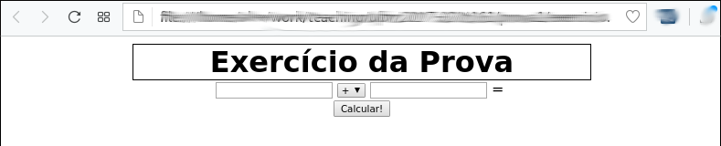
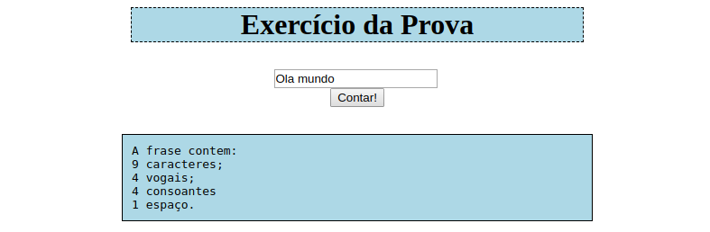
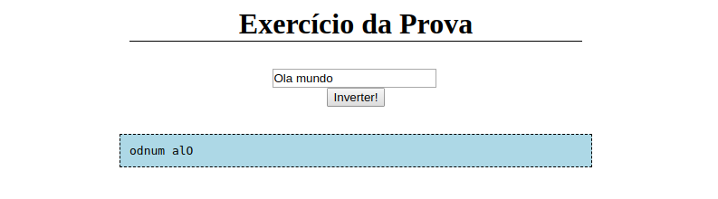

# Aula 8 - Jquery

## Bibliografia recomendada para o tema:
* [w3schools - Jquery](https://www.w3schools.com/jquery/default.asp);
* [Jquery oficial](https://jquery.com/).

## Repositório com *starter code* para a aula:
<https://gitlab.com/ds122-alexkutzke/ds122-jquery-example>

## Jquery

**Jquery** é uma biblioteca Javascript que procura facilitar tarefas recorrentes
utilizadas em programas dessa linguagem. A inteção dessa biblioteca é permitir
ao programador "escrever menos e fazer mais". Dentre as funcionalidades da linguagem
estão:

* Manipulação HTML/DOM;
* Manipulação CSS;
* Eventos HTML;
* Efeitos e animações;
* AJAX;
* Utilidades.

Para utilizar o Jquery, é necessário adicionar o arquivo JS da biblioteca no HTML.
Isso pode ser feito de duas formas diferentes:

```html
<!-- Baixar o arquivo da biblioteca e adicionar no HTML -->
<head>
<script src="jquery-3.1.1.min.js"></script>
</head>

<!-- Utilizando um CDN (Content delivery network) -->
<head>
<script src="https://ajax.googleapis.com/ajax/libs/jquery/3.1.1/jquery.min.js"></script>
</head>
```

### Sintaxe

A sintaxe básica da biblioteca Jquery é a seguinte: `$(selector).action()`, onde:

* O sinal `$` define o acesso ao jQuery (pode, inclusive, ser substituido por `JQuery`);
* O seletor é uma string para encontrar elementos HTML no DOM;
* A ação é algo para ser realizado sobre os elementos encontrados com o seletor.

```jquery
$(this).hide() // esconde o elemento "atual".

$("p").hide() // esconde todos os parágrafos.

$(".test").hide() // esconde todos os elementos com class="test".

$("#test").hide() // esconde todos os elementos com id="test".
```

### Seletores

Dentre os seletores mais utilizados, estão os seletores iguais ao do CSS.
Como `.` para classes, `#` para ids, etc.

Para mais seletores, consulte: https://www.w3schools.com/jquery/jquery_selectors.asp

### Eventos

Jquery facilita o tratamento de eventos com Javascript. Um dos mais utilizados é o `ready`

```javascript
$(document).ready(function(){

   // jQuery methods go here...

});
```

No código acima, o conteúdo da função será executado apenas quando a página estiver "pronta",
ou seja, quando todos os elementos do documento já foram carregados. O mesmo código acima pode
ser escrito com o seguinte "atalho":

```javascript
$(function(){

   // jQuery methods go here...

});
```

Além do evento `ready` o Jquery permite a manipulação de qualquer outro evento:

```javascript
// Esconde um parágrafo quando este for clicado.
$("p").click(function(){
  $(this).hide();
});

// Exibe duas mensagens: uma quando o mouse passa pelo elemento #p1 e outra quando o mouse sai do elemento
$("#p1").hover(function(){
    alert("You entered p1!");
},
function(){
    alert("Bye! You now leave p1!");
});
```

Outra forma de atribuir eventos a elementos com Jquery é por meio do método `on`:

```javascript
$("p").on("click", function(){
    $(this).hide();
});

// Atribui mais de um evento em uma única chamada ao método "on"
$("p").on({
    mouseenter: function(){
        $(this).css("background-color", "lightgray");
    },
    mouseleave: function(){
        $(this).css("background-color", "lightblue");
    },
    click: function(){
        $(this).css("background-color", "yellow");
    }
});
```
O método `on` é preferível. Ele cria apenas uma única referência para a função do evento
para todos os elementos selecionados. Isso permite uma economia de memória no cliente.
Além disso, elementos criados dinâmicamente (após a página ter sido carregada pelo navegador),
respondem a eventos criados com o `on`. O mesmo não acontece com métodos como o `click`. Nesse
caso, para cada novo elemento criado, uma nova chamada para `click` teria que ser realizada. Mais
sobre eventos sobre elementos criados dinamicamente: http://api.jquery.com/on/#direct-and-delegated-events

Para mais eventos, consulte: https://www.w3schools.com/jquery/jquery_ref_events.asp

### Manipulação do DOM com Jquery

Exemplos de manipulação do DOM com Jquery:

```javascript
// Esconder e mostrar
$("#hide").click(function(){
    $("p").hide();
});

$("#show").click(function(){
    $("p").show();
});

//---------------------
$("#btn2").click(function(){
    alert("HTML: " + $("#test").html());

    $(this).html("Novo conteúdo");
});

//---------------------
$("#btn1").click(function(){
    alert("Value: " + $("#test").val());
});

// --------------------
function appendText() {
    var txt1 = "<p>Text.</p>";               // Create element with HTML
    var txt2 = $("<p></p>").text("Text.");   // Create with jQuery
    var txt3 = document.createElement("p");  // Create with DOM
    txt3.innerHTML = "Text.";
    $("body").append(txt1, txt2, txt3);      // Append the new elements
}

//---------------------
$("p").css("background-color", "yellow");
```

### Links interessantes

* [Documentação do Jquery](http://api.jquery.com/).

### Exercícios de provas anteriores


#### 1. Considere a seguinte página web:



O funcionamento dela é simples. O usuário pode inserir um número inteiro em cada um dos campos de texto e selecionar uma das 4 operações matemáticas básicas (soma, subtração, multiplicação e divisão) no seletor ao centro. Em seguida, ao clicar em "Calcular!" a página resolve a expressão matemática definida pelo usuário e exibe o resultado na caixa abaixo. Nesse contexto, implemente a página web descrita em 3 arquivos diferentes, sendo eles:

* Um arquivo HTML com a estrutura da página;
* Um arquivo CSS com as definições de estilo da página, para que ela se pareça com a imagem acima;
* Um arquivo JS com a programação necessária para que o comportamento da págia seja o mesmo exposto no enunciado acima.

Os três arquivos devem estar relacionados entre si. Ou seja, o arquivo HTML deve fazer referência aos outros dois.

Para ajudar, segue a sintaxe de algumas tags HTML e uma função JS:

```js
# A funcao parseInt() transforma uma string em um inteiro:

var x = parseInt("123");
# x -> 123
```

#### 2. Considere a seguinte página web:



O funcionamento dela é simples. O usuário pode inserir uma frase na caixa de texto (considere que a frase contém apenas letras e espaços). Em seguida, ao clicar em "Contar!" a página exibe a contagem total de caracteres, vogais, consoantes e espaços contidos na frase inserida pelo usuário. Nesse contexto, implemente a página web descrita em 3 arquivos diferentes, sendo eles:

* Um arquivo HTML com a estrutura da página;
* Um arquivo CSS com as definições de estilo da página, para que ela se pareça com a imagem acima;
* Um arquivo JS com a programação necessária para que o comportamento da página seja o mesmo exposto no enunciado acima.

Os três arquivos devem estar relacionados entre si. Ou seja, o arquivo HTML deve fazer referência aos outros dois.

#### 3. Considere a seguinte página web:



O funcionamento dela é simples. O usuário pode inserir uma frase na caixa de texto (considere que a frase contém apenas letras e espaços). Em seguida, ao clicar em "Inverter!" a página exibe a frase inserida pelo usuário ao contrário. Nesse contexto, implemente a página web descrita em 3 arquivos diferentes, sendo eles:

* Um arquivo HTML com a estrutura da página;
* Um arquivo CSS com as definições de estilo da página, para que ela se pareça com a imagem acima;
* Um arquivo JS com a programação necessária para que o comportamento da página seja o mesmo exposto no enunciado acima.

Os três arquivos devem estar relacionados entre si. Ou seja, o arquivo HTML deve fazer referência aos outros dois.

