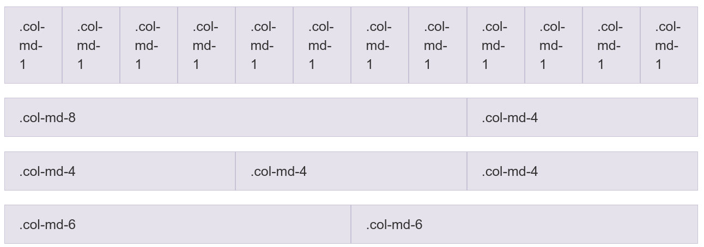

# Aula 09 - Frameworks Front-end

## Bibliografia recomendada para o tema:

### Frameworks
* [Bootstrap (versão 3)](https://getbootstrap.com/docs/3.4/): famoso framework front-end;
  * [Guia bootstrap do w3schools](https://www.w3schools.com/bootstrap/default.asp);
* [Materialize](http://materializecss.com/): baseado no Material Design;
* [W3.CSS](https://www.w3schools.com/w3css/): oficial do w3schools

### Outros recursos

* http://shoelace.io

## Starter-code
http://gitlab.com/ds122-alexkutzke/ds122-bootstrap-example

## Framworks Front-end

**Front-end** é o termo utilizado para se fazer referência à parte de uma aplicação
Web que é executadas na máquina cliente. Ou seja, em geral, envolvem as
tecnologias HTML, CSS e Javascript e se tratam, em grande medida, de detalhes
da **interface** dos sistemas Web.

**Frameworks front-end** são, por sua vez, conjuntos de especificações, arquivos 
e bibliotecas utilizados para facilitar o desenvolvimento de front-end's para 
aplicações Web. Por exemplo, um framework front-end pode ser um conjuto de arquivos 
CSS e JS que podem ser utilizados em diferentes aplicações Web, desde de que 
algumas regras para sua utilização sejam seguidas.

Em geral, o uso de um framework front-end envolve os seguintes passos:

* Carregamento dos arquivos CSS e JS do framework (por CDN ou download);
* Organização dos arquivos HTML de acordo com as especificações do framework;
* Utilização de classes CSS e funções JS disponibilizadas pelo framework.

Vários frameworks front-end são disponilizados na internet. O mais famoso deles
é conhecido por **Bootstrap**.

### Bootstrap

**Bootstrap** é o mais famoso framework front-end para desenvolvimento Web. Com
ele é possível criar aplicações **responsivas** e **mobile-first**.


Suas principais características são:

* Facilidade de uso;
* Responsividade;
* Abordagem "mobile-first";
* Compatibilidade com a maioria dos navegadores modernos.

Para utilizar o Bootstrap, é possível carregar seus arquivos a partir de CDN:

```html
<!-- Latest compiled and minified CSS -->
<link rel="stylesheet"  href="https://maxcdn.bootstrapcdn.com/bootstrap/3.3.7/css/bootstrap.min.css">

<!-- jQuery library -->
<script src="https://ajax.googleapis.com/ajax/libs/jquery/3.2.0/jquery.min.js"></script>

<!-- Latest compiled JavaScript -->
<script src="https://maxcdn.bootstrapcdn.com/bootstrap/3.3.7/js/bootstrap.min.js"></script>
```

A partir daí, basta utilizar as classes CSS e as funções JS do Bootstrap nos seus documentos HTML. Por exemplo:

```html
<div class="jumbotron text-center">
  <h1>My First Bootstrap Page</h1>
  <p>Resize this responsive page to see the effect!</p> 
</div>

<div class="container">
  <div class="row">
    <div class="col-sm-4">
      <h3>Column 1</h3>
      <p>Lorem ipsum dolor..</p>
      <p>Ut enim ad..</p>
    </div>
    <div class="col-sm-4">
      <h3>Column 2</h3>
      <p>Lorem ipsum dolor..</p>
      <p>Ut enim ad..</p>
    </div>
    <div class="col-sm-4">
      <h3>Column 3</h3> 
      <p>Lorem ipsum dolor..</p>
      <p>Ut enim ad..</p>
    </div>
  </div>
</div>
```

#### Sistema de grid

Um dos conceitos chave para a disposição de elementos utilizando o bootstrap é 
sistema de grid. Este sistema considera que toda interface criada com o Bootstrap 
será dividida virtualmente em 12 colunas de mesma largura. Além disso, qualquer
subconjunto dessas colunas podem ser divididas, novamente, em 12 partes iguais.


Esse sistema de grid permite a criação facilitada de colunas em uma interface web.
Outro ponto importante é que tal sistema garante que as colunas sejam responsivas,
ou seja, se comportem da melhor maneira possível de acordo com o tamanho de tela
do dispositivo que acesso o sistema.

Para se utilizar o sistema de grids, basta utilizar as classes do tipo `col-TIPO-LARGURA`, onde:

* TIPO:
  * `xs`: para smartphones;
  * `sm`: para tablets;
  * `md`: para desktops;
  * `lg`: para tv's e afins;
* LARGURA
  * Um tamanho de 1 a 12;

A especificação do bootstrap (http://getbootstrap.com/css/#grid) relata que as 
páginas que utilizam o framework devem ser compostas por blocos (containers) que são 
divididos em partes horizontais (rows) e que cada uma dessas partes podem ser 
compostas por diferentes disposições de colunas. A seguir, alguns exemplos de 
colunas com bootstrap.

```html
<div class="container">
  <div class="row">
    <div class="col-md-1">.col-md-1</div>
    <div class="col-md-1">.col-md-1</div>
    <div class="col-md-1">.col-md-1</div>
    <div class="col-md-1">.col-md-1</div>
    <div class="col-md-1">.col-md-1</div>
    <div class="col-md-1">.col-md-1</div>
    <div class="col-md-1">.col-md-1</div>
    <div class="col-md-1">.col-md-1</div>
    <div class="col-md-1">.col-md-1</div>
    <div class="col-md-1">.col-md-1</div>
    <div class="col-md-1">.col-md-1</div>
    <div class="col-md-1">.col-md-1</div>
  </div>
  <div class="row">
    <div class="col-md-8">.col-md-8</div>
    <div class="col-md-4">.col-md-4</div>
  </div>
  <div class="row">
    <div class="col-md-4">.col-md-4</div>
    <div class="col-md-4">.col-md-4</div>
    <div class="col-md-4">.col-md-4</div>
  </div>
  <div class="row">
    <div class="col-md-6">.col-md-6</div>
    <div class="col-md-6">.col-md-6</div>
  </div>
</div>
```



Exemplo de colunas para mais de um tamanhod e dispositivo:

```html
<!-- Stack the columns on mobile by making one full-width and the other half-width -->
<div class="row">
  <div class="col-xs-12 col-md-8">.col-xs-12 .col-md-8</div>
  <div class="col-xs-6 col-md-4">.col-xs-6 .col-md-4</div>
</div>

<!-- Columns start at 50% wide on mobile and bump up to 33.3% wide on desktop -->
<div class="row">
  <div class="col-xs-6 col-md-4">.col-xs-6 .col-md-4</div>
  <div class="col-xs-6 col-md-4">.col-xs-6 .col-md-4</div>
  <div class="col-xs-6 col-md-4">.col-xs-6 .col-md-4</div>
</div>

<!-- Columns are always 50% wide, on mobile and desktop -->
<div class="row">
  <div class="col-xs-6">.col-xs-6</div>
  <div class="col-xs-6">.col-xs-6</div>
</div>
```

Para saber mais sobre funcionalidades do Bootstrap, consulte o site oficial do 
framework. Existem classes para praticamente qualquer tag HTML.
