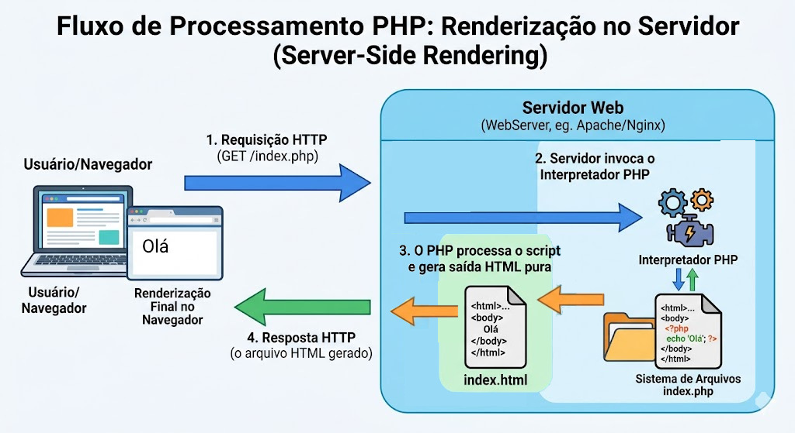

# PHP

## Bibliografia recomendada para o tema:

* [Documentação Oficial do PHP (pt-BR)](https://www.php.net/manual/pt_BR/)
* [PHP The Right Way (Boas Práticas Modernas)](https://phptherightway.com/)
* [W3Schools - PHP Tutorial](https://www.w3schools.com/php/default.asp)

## Starter-code
[https://gitlab.com/ds122-alexkutzke/ds122-php-example](https://gitlab.com/ds122-alexkutzke/ds122-php-example)

## Linguagem PHP

### Tags PHP

Quando o interpretador do PHP processa um arquivo, ele procura pelas tags de abertura e fechamento, `<?php` e `?>`, que delimitam onde o código PHP começa e termina. Tudo o que estiver fora dessas tags é ignorado pelo interpretador e repassado diretamente como texto plano (geralmente HTML) para a saída. Isso permite que o código PHP seja embutido em documentos HTML.



Existem apenas duas formas recomendadas e suportadas no PHP moderno para a abertura de tags:

1. **Tag padrão:** `<?php ... ?>` (Utilizada para blocos de código e lógica).
2. **Tag curta de impressão (Echo tag):** `<?= ... ?>` (Disponível por padrão, utilizada exclusivamente para imprimir um valor ou variável diretamente no HTML. É o equivalente exato a `<?php echo ... ?>`).

*Nota:* Historicamente, o PHP possuía outras formas de abertura, como tags estilo ASP (`<%`) ou tags curtas (`<?`). O uso destas formas foi removido da linguagem ou é estritamente desencorajado devido a problemas de portabilidade e conflito com a sintaxe XML.

### Escapando o HTML (Mesclando PHP e HTML)

A característica de ignorar o que está fora das tags permite arquivos de conteúdo misto, fundamentais para a criação de *templates*.

```php
<p>Isto vai ser ignorado pelo PHP e enviado diretamente ao navegador.</p>
<?php echo 'Enquanto isto vai ser processado no servidor.'; ?>
<p>Isto também vai ser ignorado pelo interpretador.</p>
```

Esta funcionalidade é particularmente útil em instruções de controle de fluxo (condicionais e laços de repetição). O interpretador do PHP determina o resultado da condição e decide qual bloco HTML será enviado ao cliente.

#### Exemplo 1: Sintaxe Alternativa para Estruturas de Controle

Para embutir código PHP em grandes blocos de HTML, a utilização da sintaxe alternativa (com dois pontos `:` e palavras-chave terminadoras como `endif;`, `endforeach;`) é a prática padrão e torna o código mais legível do que o uso de chaves `{}`.

```php
<?php if ($usuarioLogado == true): ?>
  <p>Bem-vindo ao sistema! Este bloco HTML só será renderizado se a condição for verdadeira.</p>
<?php else: ?>
  <p>Por favor, faça o login para continuar.</p>
<?php endif; ?>
```

Nesse exemplo, o interpretador pulará os blocos HTML em que a condição não for satisfeita. Sair do modo de interpretação do PHP (fechando a tag `?>`) para escrever HTML puro é, na maioria dos casos, mais eficiente e limpo do que armazenar grandes blocos de texto HTML dentro de funções `echo` ou variáveis.

### Separação de instruções e Omissão da Tag de Fechamento

O PHP exige que as instruções sejam terminadas com um ponto e vírgula (`;`). 

A tag de fechamento de um bloco de código `?>` implica automaticamente no encerramento da instrução anterior, dispensando o ponto e vírgula na última linha antes do fechamento.

**Regra Crítica de Boas Práticas:** Se um arquivo contiver **apenas** código PHP (sem HTML misturado, como arquivos de classes, configurações ou funções), a tag de fechamento `?>` **deve ser omitida**. Isso previne a injeção acidental de espaços em branco ou quebras de linha invisíveis no final do arquivo, o que causa erros de envio de cabeçalhos HTTP (*Headers already sent*).

```php
<?php
// Arquivo contendo apenas lógica PHP.
// A tag de fechamento ?> NÃO deve ser inserida ao final do arquivo.

echo 'Isto é um teste';
$variavel = 10;
```

### Links importantes para a Sintaxe Básica

* [Tipos de Dados](https://www.php.net/manual/pt_BR/language.types.php)
* [Variáveis](https://www.php.net/manual/pt_BR/language.variables.php)
* [Constantes](https://www.php.net/manual/pt_BR/language.constants.php)
* [Expressões](https://www.php.net/manual/pt_BR/language.expressions.php)
* [Operadores](https://www.php.net/manual/pt_BR/language.operators.php)
* [Estruturas de Controle](https://www.php.net/manual/pt_BR/language.control-structures.php)
* [Funções](https://www.php.net/manual/pt_BR/language.functions.php)

### Produção de conteúdo dinâmico

Um dos objetivos centrais da programação Web no servidor é produzir o conteúdo das páginas de maneira dinâmica, baseando-se em estruturas de dados (vetores, dicionários) e lógica de negócio.

O código a seguir demonstra a produção de uma lista não ordenada (`<ul>`) no HTML a partir de um *array* no PHP.

```php
<?php
  // É uma boa prática informar os tipos de dados que a função espera e retorna
  function cria_item_lista(string|int $item): string {
    return "<li>{$item}</li>";
  }

  function cria_lista(array $itens): string {
    $result = "<ul>\n";
    foreach ($itens as $value) {
      $result .= cria_item_lista($value);
    }
    $result .= "</ul>\n";
    
    return $result;
  }
?>

<!DOCTYPE html>
<html lang="pt-BR">
<head>
  <meta charset="UTF-8">
  <title>Testes de PHP</title>
</head>
<body>
  
  <h2>Lista Gerada Dinamicamente:</h2>
  
  <?php
    // Utiliza-se a sintaxe moderna de arrays [] (colchetes)
    $meusItens = [1, 2, 4, 5, 6, "Texto Dinâmico"];

    // A tag de impressão curta <?= atua como um echo
  ?>
  
  <?= cria_lista($meusItens) ?>

</body>
</html>
```

O exemplo acima ilustra a intersecção entre a lógica de programação do lado do servidor (processamento do *array*) e a entrega de um documento formatado para o navegador do cliente.
