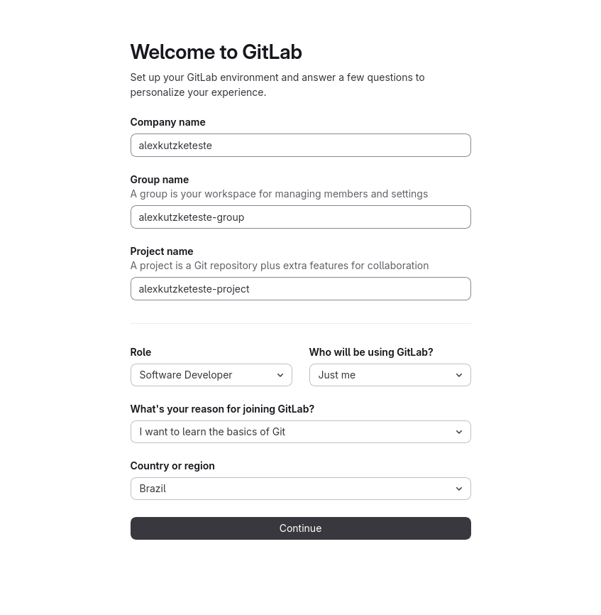
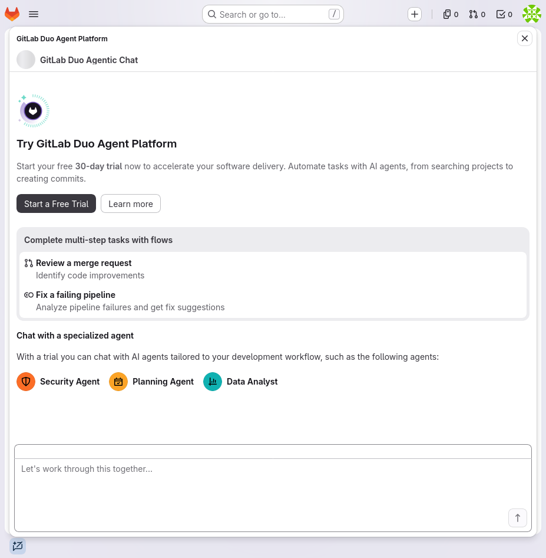

# Criação da conta no GitLab

Toda entrega da disciplina passa pelo GitLab. A conta é criada uma vez e serve o
semestre inteiro.

**Crie a conta antes da aula.** A confirmação por e-mail às vezes demora, e o
cadastro feito em sala consome o tempo que seria usado para o conteúdo.

Duas exigências da disciplina:

* **e-mail da UFPR** no cadastro;
* **nome de usuário igual ao seu GRR**, em minúsculas.

Com isso o professor localiza cada aluno sem ambiguidade, e a conta da
disciplina fica separada dos seus projetos pessoais.

> O GitLab muda essas telas com alguma frequência. Se o que aparecer no seu
> navegador não bater exatamente com o descrito aqui, siga os dois princípios:
> conta individual e plano gratuito. Nada na disciplina exige plano pago.

## Antes de começar

* o seu GRR;
* acesso ao seu e-mail da UFPR, para confirmar o cadastro;
* uma senha de pelo menos 8 caracteres.

Se você já usa o GitLab com uma conta pessoal, **mantenha essa conta como está e
crie outra** para a disciplina.

## Passo 1: o formulário de cadastro

Acesse <https://gitlab.com/users/sign_up> e preencha:

| Campo do formulário | O que preencher |
|---|---|
| **First name** | seu primeiro nome |
| **Last name** | seu sobrenome, como no registro acadêmico |
| **Username** | o seu GRR, todo em minúsculas: `grr20249999` |
| **Company email** | o seu e-mail da UFPR |
| **Password** | mínimo de 8 caracteres |
| Caixa de aviso sobre produtos e eventos | pode deixar desmarcada, é propaganda |

Sobre esse formulário:

* O rótulo do e-mail diz **Company email** e recomenda um endereço de trabalho.
  O e-mail da UFPR atende. Não use Gmail ou Hotmail pessoal.
* O **Username** entra no endereço de todos os seus repositórios e é o que o
  professor procura na hora de corrigir. Digite com atenção.
* Não use os botões **Continue with Google** ou **Continue with GitHub**: eles
  vinculam a conta ao seu perfil pessoal, que é justamente o que queremos
  evitar.

Se o GitLab avisar que o nome de usuário já está em uso, acrescente `-ufpr` ao
final (`grr20249999-ufpr`) e informe ao professor qual ficou.

## Passo 2: confirmação do e-mail

O GitLab envia uma mensagem de confirmação. Procure na caixa de entrada e
também no spam do webmail da UFPR. Se nada chegar em cerca de dez minutos, peça
o reenvio na tela de login.

Pode aparecer uma verificação por telefone, com envio de código por SMS. É o
sistema antifraude do GitLab, e informar o número resolve.

> Se alguma tela exigir **cartão de crédito** para continuar, pare e avise o
> professor. O cartão só é pedido para usar os servidores de integração
> contínua do GitLab, recurso que a disciplina não utiliza.

## Passo 3: a tela `Welcome to GitLab`

Confirmado o e-mail, o GitLab abre uma tela única, **Welcome to GitLab**, com o
subtítulo *Set up your GitLab environment and answer a few questions to
personalize your experience*. Ela pede empresa, grupo, projeto e mais quatro
informações, e não há como pular. O grupo criado aqui é o mesmo que você usaria
para as tarefas, então vale preencher com cuidado:

| Campo                                      | O que preencher                                                                                                                                          |
|--------------------------------------------|----------------------------------------------------------------------------------------------------------------------------------------------------------|
| **Company name**                           | `UFPR`. O campo é obrigatório, e o GitLab reclama se ficar vazio                                                                                         |
| **Group name**                             | `ds122-2026-2-turno-grr`, todo em minúsculas, com `n` ou `t` no lugar de `turno` e o seu GRR no lugar de `grr`. Exemplo: `ds122-2026-2-n-grr20249999` |
| **Project name**                           | `teste`. Este projeto não é usado na disciplina, e existe só porque o GitLab exige um                                                                    |
| **Role**                                   | não há opção para estudante na lista. Escolha `Software Developer`                                                                                      |
| **Who will be using GitLab?**              | `Just me`, e não `My team`                                                                                                                               |
| **What's your reason for joining GitLab?** | `I want to learn the basics of Git`                                                                                                                      |
| **Country or region**                      | `Brazil`                                                                                                                                                 |

Depois, o botão **Continue** no fim do formulário.

A captura acima foi feita com uma conta de teste, e por isso os nomes não são os
da disciplina. Use os valores da tabela.

O campo que exige atenção é o **Group name**: ele vira o endereço do seu grupo e
é por ele que o professor localiza as suas entregas. Confira letra por letra
antes de enviar, principalmente o GRR.

O nome escrito em **Company name** não tem efeito sobre a sua conta. O GitLab
pergunta porque usa o mesmo cadastro para empresas.

### Depois de enviar essa tela

O GitLab abre a criação do projeto com um painel de propaganda por cima, o
**GitLab Duo Agent Platform**, oferecendo um teste gratuito de 30 dias. Feche no
**X do canto superior direito** do painel e siga. Não clique em **Start a Free
Trial**: a disciplina não usa nada disso.

Feito isso, duas conferências rápidas no grupo recém-criado, em
**Settings > General**:

* a **visibilidade** do grupo precisa estar em **Private**;
* o nome e o endereço precisam bater com o padrão
  `ds122-2026-2-turno-grr`.

Em seguida, siga
[Entrega de exercícios e trabalhos no GitLab](./instrucoes_submissao_tarefas_e_trabalhos.md)
para adicionar o usuário `alexkutzke` ao grupo com o papel `Reporter`.

O projeto `teste` pode ficar onde está, ou ser apagado em **Settings > General >
Advanced > Delete project**. As tarefas da disciplina não saem dele: elas chegam
por *fork* dos repositórios publicados pelo professor.

## Passo 4: se aparecer qualquer outra pergunta

O GitLab muda esse questionário de tempos em tempos. Se aparecer um campo que
não está na tabela acima, como número de funcionários ou setor de atuação,
responda qualquer coisa: esses campos não afetam a sua conta nem a disciplina.

## Passo 5: o plano

A tela de boas-vindas não pede plano nenhum, mas o GitLab oferece testes pagos em
painéis e faixas espalhados pela interface, como o do **GitLab Duo** mostrado
acima e o do plano **Ultimate**. Feche todos. Quando houver escolha explícita,
procure a opção do plano **Free**, com texto parecido com `Continue with Free` ou
`Skip trial`.

Cair no teste por engano não gera cobrança: o GitLab não pede cartão de crédito
para iniciá-lo, e ao fim dos 30 dias a conta volta sozinha ao plano gratuito.
Tudo o que a disciplina usa está no plano gratuito.

## Passo 6: nome completo no perfil

No menu do seu avatar, escolha **Edit profile** e confira o campo **Full name**.
Ele já vem preenchido com o **First name** e o **Last name** do cadastro;
complete se estiver faltando parte do seu nome. O professor usa esse campo para
conferir a autoria das entregas.

## Conferência final

Antes de fechar o navegador, confirme:

- [ ] o nome de usuário é o seu GRR, em minúsculas;
- [ ] o e-mail cadastrado é o da UFPR, e já foi confirmado;
- [ ] o nome completo está preenchido no perfil;
- [ ] o grupo `ds122-2026-2-turno-grr` existe, é **privado** e tem o
      `alexkutzke` como `Reporter`.

## Problemas comuns

**Digitei o nome de usuário errado.** Dá para trocar em **Settings > Account >
Change username**. Faça isso antes de criar qualquer *fork*, porque a troca
altera o endereço de todos os repositórios.

**Errei o nome do grupo na tela de boas-vindas.** O nome se troca em **Settings > General**, e o endereço em **Settings > General > Advanced > Change group
URL**. Os dois precisam ficar no padrão. Corrija antes de criar qualquer
*fork* dentro do grupo.

**Já tenho conta pessoal e o navegador entra sempre nela.** Use uma janela
anônima para a conta da disciplina, ou saia da conta pessoal antes de entrar na
outra.

**O e-mail de confirmação não chega.** Confira o spam do webmail da UFPR e peça
o reenvio na tela de login. Persistindo, avise o professor pela UFPR Virtual.
